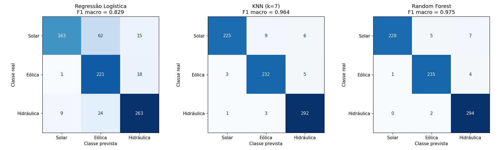
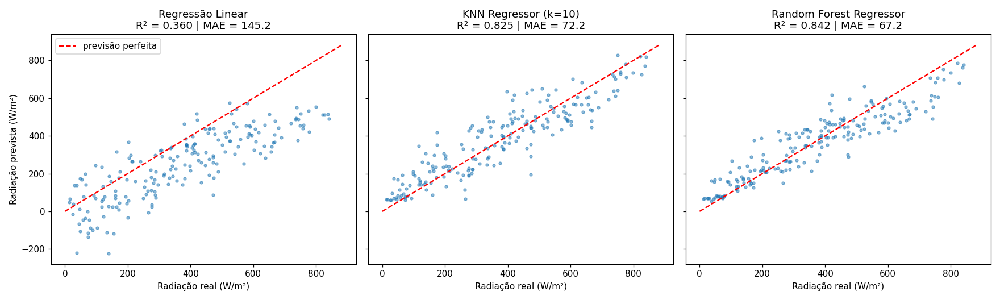
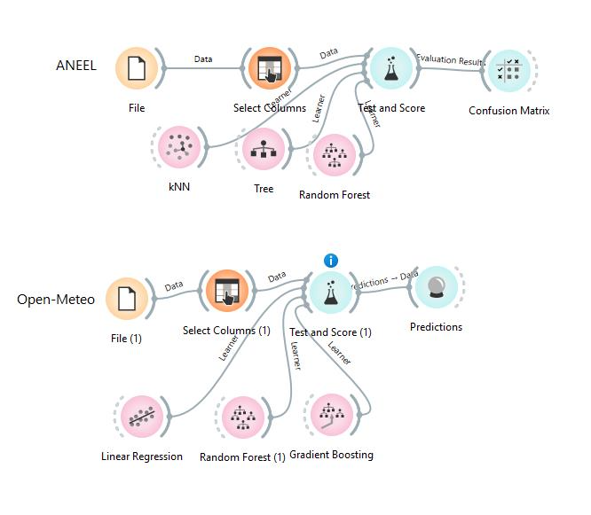
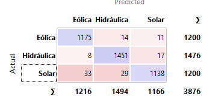
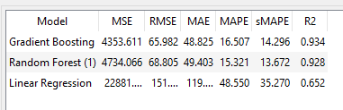
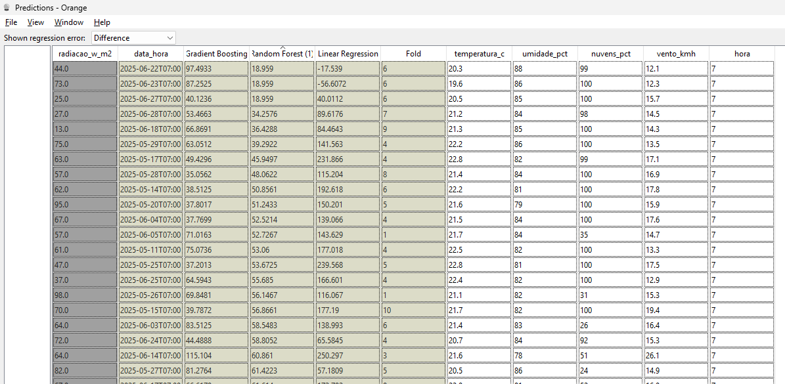

# Checkpoint 02 — APIs, energias renováveis e aprendizado de máquina

**Turma 1CCPX — FIAP**

| Integrante | RM |
|---|---|
| Brenno F. G. dos Santos | 570525 |
| Eduardo Moreira Silva | 569923 |
| Enzo Stahal Freitas | 569001 |
| Matheus Bruno de Lima | 572944 |

## Objetivo

Consultar duas APIs públicas de dados sobre energia e clima, gerar dois conjuntos de dados em CSV e resolver duas tarefas independentes de aprendizado de máquina em Python, comparando **três algoritmos em cada uma**:

1. **Classificação:** prever a fonte de um empreendimento de geração (**Solar, Eólica ou Hidráulica**) a partir da potência outorgada e da localização.
2. **Regressão:** estimar a **radiação solar global horizontal** (W/m²) em Petrolina (PE) a partir de variáveis meteorológicas e da hora do dia.

## Dados

| Tarefa | Fonte | Período / recorte | Arquivo |
|---|---|---|---|
| Classificação | [ANEEL — SIGA](https://dadosabertos.aneel.gov.br/dataset/siga-sistema-de-informacoes-de-geracao-da-aneel) (API CKAN, sem token) | Cadastro consultado na execução; até 1.200 registros por sigla (UFV, EOL, UHE, PCH, CGH) | `aneel_classificacao_orange.csv` |
| Regressão | [Open-Meteo — histórico](https://open-meteo.com/en/docs/historical-weather-api) (sem token) | 01/04/2025 a 30/06/2025, horas locais das 7h às 17h, fuso `America/Recife`, coordenadas −9,39 / −40,50 | `meteo_regressao_orange.csv` |

- **Classificação:** entradas `potencia_kw`, `latitude`, `longitude`; alvo `fonte` (UFV → Solar, EOL → Eólica, UHE/PCH/CGH → Hidráulica). O cadastro inclui empreendimentos em fases diferentes e a quantidade por classe depende do limite da consulta, portanto **não representa a matriz energética brasileira**.
- **Regressão:** entradas `temperatura_c`, `umidade_pct`, `nuvens_pct`, `vento_kmh`, `hora`; alvo `radiacao_w_m2`; `data_hora` serve apenas para ordenar. Os valores são estimativas de modelos/reanálise, não medições de um painel.

## Estrutura do repositório

| Caminho | Conteúdo |
|---|---|
| `CP02_Energia_Renovavel_ML.ipynb` | Notebook completo: consulta às APIs, análise, seis modelos, métricas, gráficos e interpretação |
| `aneel_classificacao_orange.csv` | Dados da Tarefa 1 gerados pelo notebook |
| `meteo_regressao_orange.csv` | Dados da Tarefa 2 gerados pelo notebook |
| `meteo_treino_orange.csv` / `meteo_teste_orange.csv` | Divisão temporal 80/20 usada no Orange |
| `figuras/` | Gráficos gerados pelo notebook |
| `resultados/` | Tabelas de métricas (CSV) e resumo dos resultados |
| `orange/` | Fluxo do Orange e capturas de tela da atividade complementar |
| `requirements.txt` | Bibliotecas necessárias |

## Como executar

```bash
git clone <link-deste-repositorio>
cd <pasta-do-repositorio>
python -m venv .venv
# Windows: .venv\Scripts\activate    |    Linux/macOS: source .venv/bin/activate
pip install -r requirements.txt
jupyter notebook CP02_Energia_Renovavel_ML.ipynb
```

No Jupyter, use **Run All**. O notebook consulta as duas APIs (é preciso internet), recria os CSVs, treina os modelos, salva os gráficos em `figuras/` e atualiza automaticamente a seção de resultados deste README. Nenhuma API exige senha ou token.

## Metodologia

### Tarefa 1 — Classificação

- Divisão **estratificada 80% treino / 20% teste**, `random_state=42`, igual para os três modelos.
- Modelos: **Regressão Logística**, **KNN (k=7)** e **Random Forest (300 árvores)**.
- Pré-processamento (dentro de `Pipeline`, ajustado só no treino): `log(1 + potência)` e padronização para Regressão Logística e KNN; o Random Forest usa os dados originais.
- Métricas: Accuracy, Precision, Recall e F1 com **média `macro`** (mesmo peso para cada classe) e matriz de confusão. O F1 `weighted` aparece como referência.

### Tarefa 2 — Regressão

- Divisão **temporal**: primeiras 80% das horas para treino e últimas 20% para teste, sem embaralhar.
- Modelos: **Regressão Linear**, **KNN Regressor (k=10)** e **Random Forest Regressor (300 árvores)**.
- Padronização dentro do `Pipeline` para Regressão Linear e KNN.
- Métricas: **MAE** (W/m²), **MSE** ((W/m²)²), RMSE (W/m²) e **R²**, além de gráficos de valores reais × previstos.

<!-- RESULTADOS_INICIO -->
## Resultados obtidos (gerado pelo notebook)

### Tarefa 1 — Classificação (teste estratificado 20%, semente 42, métricas com média macro)

Linhas usadas: 3876 | treino: 3100 | teste: 776

| Modelo | Accuracy | Precision (macro) | Recall (macro) | F1 (macro) | F1 (weighted) |
|---|---|---|---|---|---|
| Random Forest | 0.976 | 0.977 | 0.974 | 0.975 | 0.975 |
| KNN (k=7) | 0.965 | 0.966 | 0.964 | 0.964 | 0.965 |
| Regressão Logística | 0.834 | 0.850 | 0.830 | 0.829 | 0.833 |

**Melhor modelo (F1 macro):** Random Forest.

### Tarefa 2 — Regressão (treino: primeiras 80% das horas; teste: últimas 20%)

Horas usadas: 1001 | treino: 800 | teste: 201

| Modelo | MAE (W/m²) | MSE ((W/m²)²) | RMSE (W/m²) | R² |
|---|---|---|---|---|
| Random Forest Regressor | 67.19 | 7,419.60 | 86.14 | 0.84 |
| KNN Regressor (k=10) | 72.18 | 8,222.93 | 90.68 | 0.82 |
| Regressão Linear | 145.20 | 30,034.20 | 173.30 | 0.36 |

**Melhor modelo (R²):** Random Forest Regressor.

<!-- RESULTADOS_FIM -->





## Conclusões

### Tarefa 1 — Classificação

- Potência e localização permitem separar as fontes razoavelmente bem, porque cada uma tem uma geografia típica: eólicas no Nordeste e no litoral Sul, hidráulicas no Sul, Sudeste e Centro-Oeste, e solares espalhadas, com forte presença no Nordeste e em Minas Gerais.
- Os modelos não lineares (Random Forest e KNN) tendem a superar a Regressão Logística, que só traça fronteiras lineares entre as classes.
- As confusões aparecem onde as classes se sobrepõem: solares e pequenas hidrelétricas (CGH/PCH) com potências parecidas, e solares e eólicas próximas no Nordeste.
- **Limitações:** coordenadas aproximadas, potência outorgada não é energia gerada, faltam variáveis físicas (rios e desnível, vento, irradiação, relevo) e a amostra tem proporções artificiais entre as classes. O modelo não é adequado para uma aplicação real sem esses dados.

### Tarefa 2 — Regressão

- A **hora do dia** é a entrada mais importante: ela define a posição do Sol e, portanto, a radiação máxima possível. A relação tem forma de sino (sobe de manhã e desce à tarde), algo que a Regressão Linear não representa bem.
- A **cobertura de nuvens** explica quanto dessa radiação chega ao solo; os modelos não lineares aprendem a interação entre hora e nuvens e erram menos.
- **Radiação não é geração elétrica:** a radiação é potência por área (W/m²) sobre uma superfície horizontal; a energia gerada (kWh) depende da área e eficiência dos módulos, inclinação e orientação, temperatura das células, sombreamento, sujeira e perdas no inversor e nos cabos. Além disso, os dados são estimativas de reanálise para um ponto aproximado, não medições de um sistema real.

## Atividade complementar — Orange Data Mining

As duas tarefas foram refeitas no Orange a partir dos CSVs gerados pelo notebook, com **três algoritmos em cada uma** comparados sob a mesma configuração de Test & Score. O fluxo base do professor está em `orange/Fluxos_para_Classificacao_e_Regressao.ows`.



### 1. Classificação — ANEEL

**Fluxo:** **File** (`aneel_classificacao_orange.csv`) → **Select Columns** → **Test and Score** → **Confusion Matrix**

| Papel | Atributos |
|---|---|
| Features | `potencia_kw` (potência outorgada, kW), `latitude`, `longitude` (graus decimais) |
| Target | `fonte` (Solar, Eólica, Hidráulica) |

**Algoritmos** (ligados ao Test and Score como *Learner*): **kNN**, **Tree** (árvore de decisão) e **Random Forest**.

**Procedimento de avaliação:** PREENCHER (a mesma opção de Test and Score para os três modelos, ex.: Random Sampling estratificado, 80% treino, 10 repetições, ou Cross validation com 10 folds estratificados)

| Modelo | CA | Precision | Recall | F1 |
|---|---|---|---|---|
| kNN | | | | |
| Tree | | | | |
| Random Forest | | | | |

**Análise:**

- **Melhor modelo:** PREENCHER. No notebook, o Random Forest também foi o melhor (F1 macro 0,975), seguido do kNN (0,964).
- **Classes confundidas (Confusion Matrix):** a matriz abaixo (modelo: PREENCHER) cobre as 3.876 linhas e acerta 3.764 delas, ou seja, **97,1%**.



| Real \ Previsto | Eólica | Hidráulica | Solar | Total | Acerto da classe |
|---|---|---|---|---|---|
| Eólica | **1175** | 14 | 11 | 1200 | 97,9% |
| Hidráulica | 8 | **1451** | 17 | 1476 | 98,3% |
| Solar | 33 | 29 | **1138** | 1200 | 94,8% |

  - **Solar é a classe mais difícil:** 62 usinas solares foram classificadas errado, 33 como Eólica e 29 como Hidráulica. As solares estão espalhadas pelo país e têm potências de todos os tamanhos, então se sobrepõem às eólicas no Nordeste e às pequenas hidrelétricas (CGH/PCH) no Sul, Sudeste e Centro-Oeste.
  - **Hidráulica é a mais bem reconhecida** (98,3%). A maior parte dos seus erros vai para Solar (17), e quase nenhum para Eólica (8), porque hidrelétricas e eólicas ficam em regiões bem diferentes.
  - **Eólica** erra pouco (25 casos) e se divide entre Hidráulica (14) e Solar (11).
- **Limitação:** potência e localização só descrevem **onde** e **de que tamanho** é o empreendimento. Faltam as variáveis físicas que definem a fonte, como rios e desnível, vento, irradiação e relevo. Além disso, as coordenadas são aproximadas e a potência outorgada não é energia gerada.
- A quantidade de exemplos por classe vem do limite da consulta à API, então **não representa a participação das fontes na matriz energética brasileira**.

### 2. Regressão — Open-Meteo

**Fluxo:** **File (1)** (`meteo_regressao_orange.csv`) → **Select Columns (1)** → **Test and Score (1)** → **Predictions**

| Papel | Atributos |
|---|---|
| Features | `temperatura_c` (°C), `umidade_pct` (%), `nuvens_pct` (%), `vento_kmh` (km/h), `hora` (hora local) |
| Target | `radiacao_w_m2` (radiação solar global horizontal média da hora anterior, W/m²) |
| Meta | `data_hora` (identifica e ordena as observações) |

**Algoritmos** (ligados ao Test and Score (1) como *Learner*): **Linear Regression**, **Random Forest** e **Gradient Boosting**. O Test and Score (1) envia as previsões para o widget **Predictions**, usado para examinar os erros de cada modelo.

**Procedimento de avaliação:** **Cross validation com 10 folds**, a mesma para os três modelos. A coluna *Fold* do widget Predictions confirma isso: cada linha aparece como teste em um dos folds de 1 a 10.

**Limitação:** a validação cruzada embaralha as horas, e isso não reproduz a divisão temporal 80/20 do notebook. Horas vizinhas, com clima quase igual, caem ao mesmo tempo no treino e no teste, então o resultado tende a sair **otimista**. Por isso a comparação numérica com o notebook não é direta.

| Modelo | MAE | MSE | RMSE | R² |
|---|---|---|---|---|
| **Gradient Boosting** | **48,8** | **4.353,6** | **66,0** | **0,934** |
| Random Forest | 49,4 | 4.734,1 | 68,8 | 0,928 |
| Linear Regression | ≈ 119 | ≈ 22.881 | ≈ 151,3 | 0,652 |

MAE e RMSE em W/m², MSE em (W/m²)². Os valores da Linear Regression aparecem cortados na tela do Orange, por isso estão aproximados.



Se o Orange mostrar apenas RMSE, MSE = RMSE².

**Análise:**

- **Melhor modelo:** **Gradient Boosting**, com R² = 0,934 e MAE = 48,8 W/m². Ele explica 93% da variação da radiação e erra, em média, cerca de 49 W/m². O **Random Forest** ficou praticamente empatado (R² = 0,928, MAE = 49,4 W/m²).
- **Linear Regression** ficou bem atrás: R² = 0,652, MAE ≈ 119 W/m² e MSE cerca de 5 vezes maior. O MSE pune erros grandes, e a reta erra muito no começo e no fim do dia.
- **Comparação com o notebook:** a ordem é a mesma (modelos de árvores muito à frente da regressão linear), mas os valores do Orange são mais altos. No notebook, o Random Forest teve R² = 0,84 na divisão temporal, contra 0,928 aqui. A diferença vem da validação cruzada aleatória, que é mais otimista para dados no tempo, e do Gradient Boosting, que não foi usado no notebook.
- **Erros no Predictions:** o print abaixo mostra as primeiras horas da manhã (7h), quando a radiação real é baixa, entre 13 e 98 W/m². O **Random Forest** e o **Gradient Boosting** ficam próximos disso, com previsões entre cerca de 19 e 115 W/m². A **Linear Regression** erra muito: prevê até **250 W/m²** e chega a dar valores **negativos** (−56,6 W/m²), o que é fisicamente impossível. Isso mostra que uma reta não acompanha a curva da radiação ao longo do dia.



- **Papel da hora:** a hora define a posição do Sol e, portanto, a radiação máxima possível. A relação tem forma de sino: sobe de manhã, atinge o pico perto do meio-dia e desce à tarde. A Regressão Linear só representa relações em linha reta e não captura essa curva. Random Forest e Gradient Boosting capturam, e também aprendem a interação entre hora e cobertura de nuvens.
- **Radiação não é geração elétrica:** radiação é potência por área (W/m²) chegando a uma superfície horizontal. A energia gerada (kWh) depende também da área e da eficiência dos módulos, da inclinação e orientação, da temperatura das células, de sombreamento e sujeira, e das perdas no inversor e nos cabos. Além disso, os dados da Open-Meteo são estimativas de reanálise para um ponto, não medições de uma usina.
